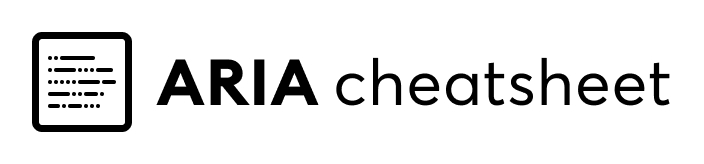

<h1 align="center">ARIA cheatsheet</h1>

<h4 align="center">Curated cheatsheet and examples of accessible, basic web elements.</h4>

## Foreword

We, web developers are responsible for making the Internet more accessible, though we often forget (...or we are just lazy) to implement the features, which would help us to achieve this goal.<br />
Therefore I started to assemble a cheatsheet, which is designed to help developers finding concise information about every major web element's accessibility criteria and copy pastable examples.

## Contributing

TODO

## Table of Contents

* Best practices
* Components
  * Button
  * Input
  * Textarea
  * Dialog *(Modal)*
  * Switch
  * Menu *(Dropdown)*
  
---

### Button

**HTML:**
```html
<div tabindex="0" role="button">
  Click me!
</div>
```

**Props:**

| Name           | Description                                                          | Values                   |    |
|:---------------|:---------------------------------------------------------------------|:-------------------------|:---|
| `role`         | The button role identifies an element as a button to screen readers. | `'button'`               |    |
| `aria-pressed` | Only needed for toggle buttons                                       | `boolean` or `undefined` |    |
| `aria-label`   | Specify if your button is represented by an icon.                    | `string`                 |    |

**Interaction keys:**
* <kbd>Enter</kbd>: Activates button
* <kbd>Space</kbd>: Activates button

**Required Javascript features:**
* `onclick`
* `onKeyDown`

[⬆️ Back to top](#table-of-contents) - [📖 MDN docs](https://developer.mozilla.org/en-US/docs/Web/Accessibility/ARIA/Roles/button_role)

--- 
